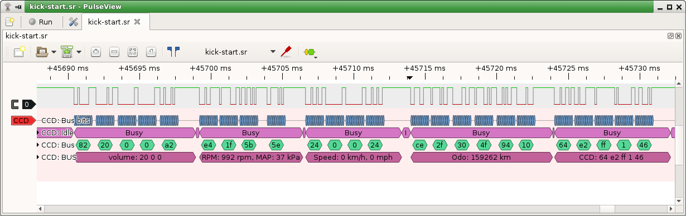

# CCD (Chrysler Collision Detect) Data Bus protocol decoder for Sigrok

This protocol decoder is heavily based and tested on dumps from Jeep ZJ '98.

# Credits

It's alive because:
- First inspiration: http://www.kolumbus.fi/juha.niinikoski/CCD_bus/ccd_display.htm
- Great datasheet for CDP68HC68S1
- Some Chrysler's US patents (for example 4,706,082)
- Great summary of everything in one place: http://www.cnblogs.com/shangdawei/p/3570499.html
- Forum topic at: http://thespeedfreaks.net/showthread.php?12585-CCDuino-A-ZJ-Databus-Project/
- Another CCD project: https://chryslerccdsci.wordpress.com/
- projects from https://github.com/xerootg/
- Google Sheet with data: https://docs.google.com/spreadsheets/d/1-7Ahhgu7fPNAfORWXrjADwHnI8PiozMbrc1AF3RrglQ

and of course because of great extendable logic analyzer: https://sigrok.org/

# Installation

Just copy ccd/ directory to place where all protocol decoders from Sigrok are.
On Linux, it's enough to copy it to local directory:
$HOME/.local/share/libsigrokdecode/decoders/

